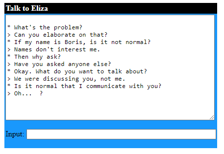
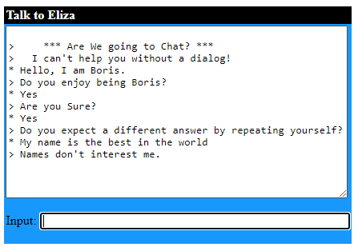
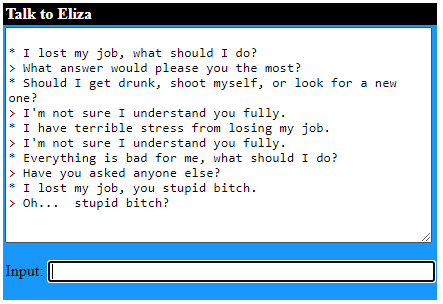
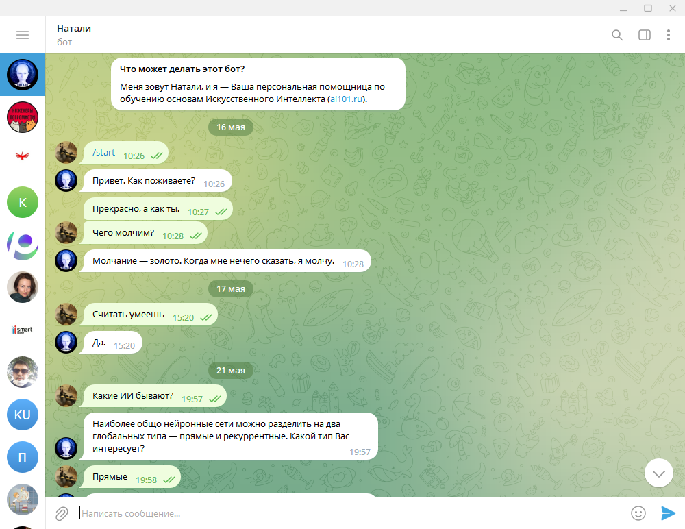
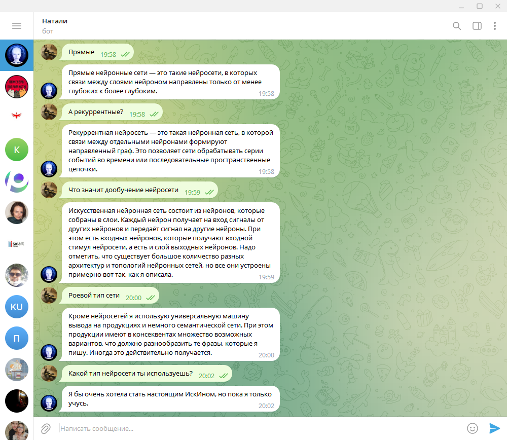

# Домашняя работа 1

## Eliza, the Rogerian Therapist

  
  
  

Общие ответы, не понимат контекст. Диалог наладить не удалось. Отвечает вопросом на вопрос. Мне кажется даже для чат бота никуда не годится.  

## Natali

  
  

### Задача  

> Попробуйте понять, как она устроена. Пришлите Вашу гипотезу об её устройстве преподавателю.  

Кроме нейросетей она использует универсальную машину вывода на продукциях и немного семантической сети. При этом продукции имеют в консеквентах множество возможных вариантов, что должно разнообразить те фразы, которые она пишет. Иногда это действительно получается.  

Это она мне так сказала, если б я еще понимал, что это значит.  
