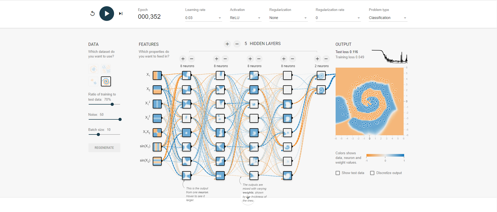

# Домашняя работа 2

  
  
  
  
  

Принципа работы нейросетей, я так и не понял. Почему подача данных в разном виде влияет на правильное решение, как он их проверяет, как изменяются веса, и вообще веса каких конкретно, это событий.  
